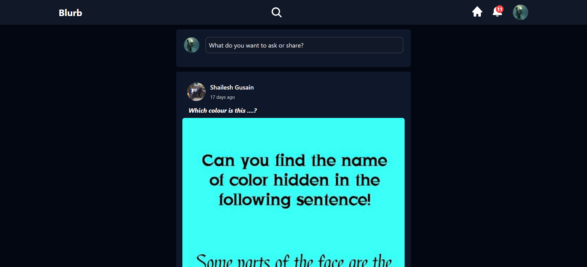
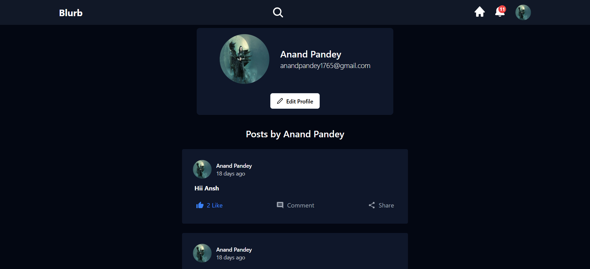
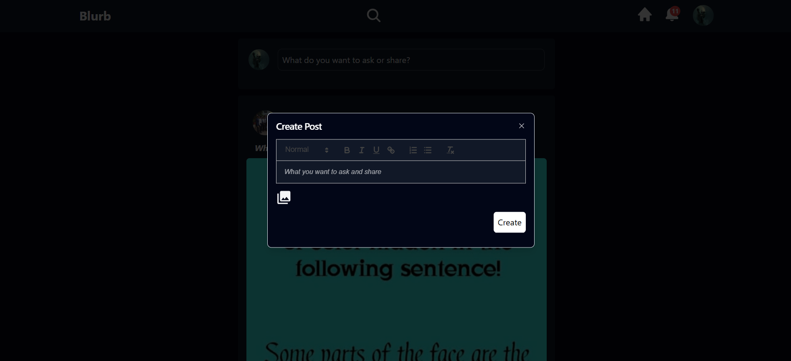
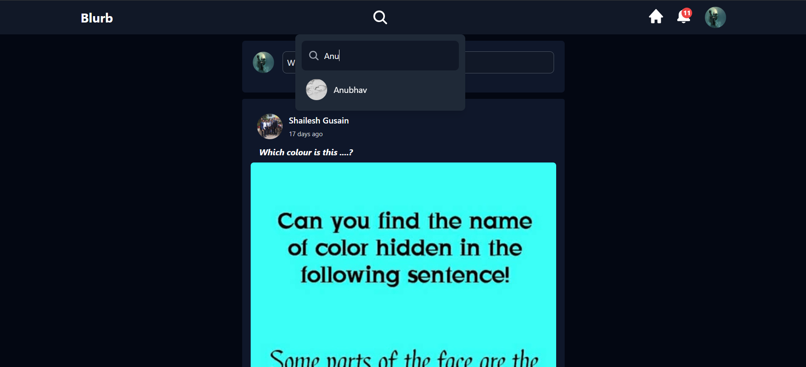

# Blurb

**Blurb** is a social media platform inspired by Quora, where users can share their thoughts, ask questions, and engage in meaningful discussions. With a user-friendly interface and interactive features, Blurb provides a space for exchanging ideas and connecting with others.

## Features

- **User Authentication:**
  - Secure sign-up and login functionality.
  - Integration with Google Login for quick access.
- **Post Management:**
  - Create, read, and share posts.
  - View posts created by others on the homepage.
- **Profile Management:**
  - Personalized user profiles to showcase your posts.
- **Search Functionality:**
  - Search for users and posts easily with keywords.
- **Responsive Design:**
  - Optimized for desktops, tablets, and mobile devices.

## Tech Stack

- **Frontend:** React.js, Tailwind CSS, Redux
- **Backend:** Node.js, Express.js
- **Database:** MongoDB
- **Authentication:** JWT (JSON Web Tokens), Google OAuth
- **Deployment:**
  - Frontend hosted on Netlify
  - Backend hosted on Render.com

## Screenshots

### Homepage

### Profile Page

### Post Creation

### Search Users

